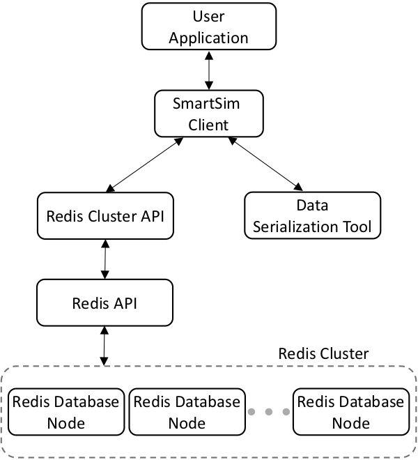

*******
Clients
*******

.. list-table:: Supported Languages
   :widths: 25 25
   :header-rows: 1
   :align: center

   * - Language
     - Version/Standard
   * - Python
     - 3.7+
   * - C++
     - C++11
   * - C
     - C99
   * - Fortran
     - Fortran 2003 +

Simulation and data analytics codes communicate with the database using
SmartSim clients written in the native language of the codebase. These
clients perform two essential tasks (both of which are opaque to the application):

 1. Serialization/deserialization of data
 2. Communication with the database

The API for these clients are designed so that implementation within
simulation and analysis codes requires minimal modification to the underlying
codebase.

|SmartSim Clients|

Supporting Fortran and C
========================
Communication with a Redis or KeyDB database is simple in C++ and Python due
to the existence of open source redis clients exist in those languages. The
SmartSim C and Fortran clients wrap the methods of C++ client with the
appropriate bindings.

C client
--------
The C-client only needs to do a minimal amount of manipulations so that the
functions are compatible. The C++ SmartSim client is instantiated as a void
pointer and pointer to the appropriate structure-like methods. To view the
API for the C client, see `C client API documentation <clients/c.html>`_

Fortran Client
--------------

Requirements
************
- Fortran 90 (or later) compliant codebase
- Fortran 2003 (or later) compliant compiler
- Compiler chain that can cross-compile Fortran and C, C and C++

Design philosophy
*****************

The SmartSim Fortran Client is designed to require minimal modification to
Fortran codebases in order to communicate with the rest of SmartSim. The entire
functionality of the C and C++ clients are contained within a single Fortran
2000 compliant module. The public interfaces rely only on primitive Fortran
data structures (e.g. n-dimensional numeric arrays and character arrays).

The Fortran Client leverages the formalized interoperability between C and
Fortran without the need for users to ever call the underlying C functions. The
conversion of Fortran primitive types to C-compatible types is handled within
the client. The Fortran Client handles the following operations, all of which
are opaque to the user:

    - Translate Fortran character arrays (used for strings) to a
      null-terminated, C-style string
    - Convert from column-major (Fortran) array convention to row-major
      (C) arrays
    - Handle arbitrarily-indexed Fortran arrays

Client functionality
********************

The Fortran client has the same functionality as the C and C++ clients. The
Fortran API is much simpler in comparison due to Fortran's native support of
arrays and overloading of functions and subroutines. The former means the
procedure calls are significantly shorter since the shape of the arrays can
inferred using Fortran intrinsics. The latter means that the same procedure
call can be used for different datatypes.

The following four fundamental SmartSim operations are supported for single
and double precision `real` and `integer` (see the API documentation for more
details).

- ``put_array``/``get_array``: Send or receive an arbitrarily indexed array of any
  rank or shape to the database
- ``put_scalar``/``get_scalar``: Send or receive a scalar value from the database
- ``poll_key_and_check_scalar``: A blocking function that polls the database
  for the existence and value of a specific key

For more information on the Fortran client see
`Fortran client API documentation <clients/fortran.html>`_

Redis Client Libraries
======================

The clients use the Redis cluster API to interact with the KeyDB database.
Specifically, C, C++, and Fortran clients use the redis-plus-plus cluster
API and the Python client uses the redis-py-cluster.