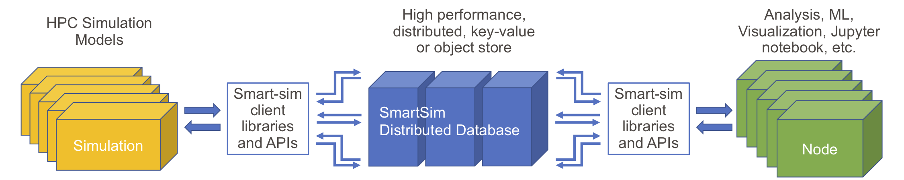

***********
Experiments
***********

The Experiment object acts as an API for SmartSim. The Experiment
acts as both a factory function as well as an interface to interact
with the entities created by the experiment.

The interface was designed to be simple with as little complexity
as possible, and agnostic to the backend launching mechanism (local,
Slurm, PBS, Kubernetes, etc).

|SmartSim Architecture|

Entities
========

The Experiment class creates entities (objects) that are setup
to run easily on the launching backend specified by the user in
the initialization of the experiment.

Model
-----

``Model(s)`` are created through the Experiment API. Models represent
any computational kernel capable of running on the system. Models
are flexible enough to support nearly any type of script or application, however,
to be used with our clients (smartredis) the application will have to
be written in Python, C, C++, or Fortran.

Models are given ``run_settings`` which are dictionaries of settings
used to tell the launcher backend how to execute the kernel on the
system. For the most part, this is as easy as providing an executable
with arguments. For systems that support workload managers like Slurm,
the run settings consist of any argument that would have normally
been passed to the ``srun`` call.

Ensemble
--------
In addition to a single model, SmartSim has the ability to launch an
``Ensemble(s)`` of simulations simultaneously. An ensemble can be manually
constructed(by adding ``Model`` objects) or SmartSim can be used to create an
ensemble of models.

Ensembles can be given parameters and ``permutation strategies`` that
define how the Ensemble will create the underlying model objects.
User-defined character tags in provided configuration files (e.g. Fortran namelists or XML)
can be replaced with specific parameter values.

Orchestrator
------------
The Orchestrator is an in-memory database, clustered or standalone, that
is launched prior to the simulation. The Orchestrator can be used
to store and retrieve data stored in memory during the course of
an experiment. In order to stream data into the orchestrator or
receive data from the orchestrator, one of the SmartSim clients
has to be used within a ``Model``.

The use of an in-memory, distributed database to store data is one
of the key components of SmartSim that allows for scalable simulation
and analysis workloads. The inclusion of an in-memory database
provides data persistence so that the data can be accessed at any time
during or after the SmartSim experiment.

For more information on the Orchestrator, please see the Orchestrator
documentation section.