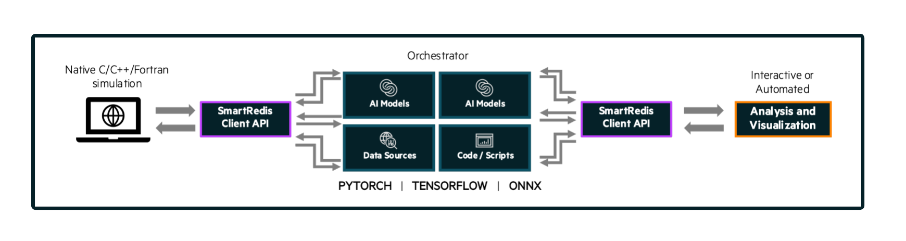

***********
Experiments
***********
========
Overview
========
SmartSim helps automate the deployment of AI-enabled workflows on HPC systems. With SmartSim, users
can describe and launch combinations of applications and AI/ML infrastructure to produce novel and
scalable workflows. SmartSim supports launching these workflows on a diverse set of systems, including
local environments such as Mac or Linux, as well as HPC job schedulers (e.g. Slurm, PBS Pro, and LSF).

The ``Experiment`` API is SmartSim's top level API that provides users with methods for creating, combining,
configuring, launching and monitoring :ref:`entities<entities_exp_docs>` in an AI-enabled workflow. More specifically, the
``Experiment`` API offers three customizable workflow components that are created and initialized via factory
methods:

* :ref:`Orchestrator<orchestrator_exp_docs>`
* :ref:`Model<model_exp_docs>`
* :ref:`Ensemble<ensemble_exp_docs>`

Settings are given to ``Model`` and ``Ensemble`` objects to provide parameters for how the job should be executed. The
:ref:`Experiment API<experiment_api>` offers two customizable Settings objects that are created via the factory methods:

* :ref:`RunSettings<run_settings_doc>`
* :ref:`BatchSettings<batch_settings_doc>`

Once a workflow component is initialized (e.g. ``Orchestrator``, ``Model`` or ``Ensemble``), a user has access
to the associated entity API which supports configuring and retrieving the entities' information:

* :ref:`Orchestrator API<orchestrator_api>`
* :ref:`Model API<model_api>`
* :ref:`Ensemble API<ensemble_api>`

There is no limit to the number of SmartSim entities a user can
initialize within an ``Experiment``.

  Sample ``Experiment`` showing a user application leveraging
  machine learning infrastructure launched by SmartSim and connected
  to online analysis and visualization via the in-memory ``Orchestrator``.

Find an example of the ``Experiment`` class and factory methods used within a
workflow in the :ref:`Example<exp_example>` section of this page.

.. _launcher_exp_docs:

=========
Launchers
=========
SmartSim supports launching AI-enabled workflows on a wide variety of systems, including locally on a Mac or
Linux machine or on HPC machines with a job scheduler (e.g. Slurm, PBS Pro, and LSF). When creating a SmartSim
``Experiment``, the user has the opportunity to specify the `launcher` type or defer to automatic `launcher` selection.
`Launcher` selection determines how SmartSim translates entity configurations into system calls to launch,
manage, and monitor. Currently, SmartSim supports 5 `launchers`:

1. ``local`` **[default]**: for single-node, workstation, or laptop
2. ``slurm``: for systems using the Slurm scheduler
3. ``pbs``: for systems using the PBS Pro scheduler
4. ``pals``: for systems using the PALS scheduler
5. ``lsf``: for systems using the LSF scheduler
6. ``auto``: have SmartSim auto-detect the launcher to use

If the systems `launcher` cannot be found or no `launcher` argument is provided, the default value of
`"local"` will be assigned which will start all ``Experiment`` launched entities on the
localhost.

For examples specifying a `launcher` during ``Experiment`` initialization, navigate to the
``Experiment`` :ref:`__init__ special method<exp_init>` in the ``Experiment`` API docstring.

.. _entities_exp_docs:

========
Entities
========
Entities are SmartSim API objects that can be launched and
managed on the compute system through the ``Experiment`` API.
The SmartSim entities include:

* ``Orchestrator``
* ``Model``
* ``Ensemble``

While the ``Experiment`` object is intended to be instantiated once in the
Python driver script, there is no limit to the number of SmartSim entities
within the ``Experiment``. In the following subsections, we define the
general purpose of the three entities that can be created through the
``Experiment``.

To create a reference to a newly instantiated entity object, use the
associated ``Experiment.create_...`` factory method shown below.

.. list-table:: Experiment API Entity Creation
   :widths: 20 65 25
   :header-rows: 1

   * - Factory Method
     - Example
     - Return Type
   * - ``create_database``
     - ``orch = exp.create_database([port, db_nodes, ...])``
     - :ref:`Orchestrator <orchestrator_api>`
   * - ``create_model``
     - ``model = exp.create_model(name, run_settings)``
     - :ref:`Model <model_api>`
   * - ``create_ensemble``
     - ``ensemble = exp.create_ensemble(name[, params, ...])``
     - :ref:`Ensemble <ensemble_api>`

After initialization, each entity can be started, monitored, and stopped using
the ``Experiment`` post-creation methods.

.. list-table:: Interact with Entities During the Experiment
   :widths: 25 55 25
   :header-rows: 1

   * - Factory Method
     - Example
     - Desc
   * - ``start``
     - ``exp.start(*args[, block, summary, ...])``
     - Launch an Entity
   * - ``stop``
     - ``exp.stop(*args)``
     - Stop an Entity
   * - ``get_status``
     - ``exp.get_status(*args)``
     - Retrieve Entity Status

.. _orchestrator_exp_docs:

Orchestrator
============
The :ref:`Orchestrator<orch_docs>` is an in-memory database built for
a wide variety of AI-enabled workflows. The ``Orchestrator`` can be thought of as a general
feature store for numerical data, ML models, and scripts. The ``Orchestrator`` is capable
of performing inference and script evaluation using data in the feature store.
Any SmartSim ``Model`` or ``Ensemble`` member can connect to the
``Orchestrator`` via the :ref:`SmartRedis<smartredis-api>`
``Client`` library to transmit data, execute ML models, and execute scripts.

**SmartSim Offers Two Types of Orchestrator Deployments:**

* :ref:`Standalone Orchestrator Deployment<standalone_orch_doc>`
* :ref:`Colocated Orchestrator Deployment<colocated_orch_doc>`

To create a standalone ``Orchestrator`` that does not share compute resources with other
SmartSim entities, use the ``Experiment.create_database`` factory method which
returns an ``Orchestrator`` object. To create a colocated ``Orchestrator`` that
shares compute resources with a ``Model``, use the ``Model.colocate_db_tcp``
or ``Model.colocate_db_uds`` member functions accessible after a
``Model`` object has been initialized. The functions instruct
SmartSim to launch an ``Orchestrator`` on the application compute nodes. An ``Orchestrator`` object is not
returned from a ``Model.colocate_db`` instruction, and subsequent interactions with the
colocated ``Orchestrator`` are handled through the :ref:`Model API<model_api>`.

SmartSim supports :ref:`multi-database<mutli_orch_doc>` functionality, enabling an ``Experiment`` to have
several concurrently launched ``Orchestrator(s)``. If there is a need to launch more than
one ``Orchestrator``, the ``Experiment.create_database`` and ``Model.colocate..``
functions mandate the specification of a unique ``Orchestrator`` identifier, denoted
by the `db_identifier` argument for each ``Orchestrator``. The `db_identifier` is used
in an application script by a SmartRedis ``Client`` to connect to a specific ``Orchestrator``.

.. _model_exp_docs:

Model
=====
:ref:`Model(s)<model_object_doc>` represent a simulation model or any computational kernel,
including applications, scripts, or generally, a program. They can
interact with other SmartSim entities via data transmitted to/from
SmartSim ``Orchestrator(s)`` using a SmartRedis ``Client``.

A ``Model`` is created through the factory method: ``Experiment.create_model``.
``Model(s)`` are initialized with ``RunSettings`` objects that specify
how a ``Model`` should be launched by a workload manager
(e.g., Slurm) and the compute resources required.
Optionally, the user may also specify a ``BatchSettings`` object if
the ``Model`` should be launched as a batch job on the WLM system.
The ``create_model`` factory method returns an initialized ``Model`` object that
gives you access to functions associated with the :ref:`Model API<model_api>`.

A ``Model`` supports key features, including methods to:

- :ref:`Attach configuration files<files_doc>` for use at ``Model`` runtime.
- :ref:`Colocate an Orchestrator<colo_model_doc>` to a SmartSim ``Model``.
- :ref:`Load an ML model<ai_model_doc>`  into the ``Orchestrator`` at ``Model`` runtime.
- :ref:`Load a TorchScript function<TS_doc>`  into the ``Orchestrator`` at ``Model`` runtime.
- :ref:`Enable data collision prevention<model_key_collision>` which allows
  for reuse of key names in different ``Model`` applications.

Visit the respective links for more information on each topic.

.. _ensemble_exp_docs:

Ensemble
========
In addition to a single ``Model``, SmartSim allows users to create,
configure, and launch an :ref:`Ensemble<ensemble_doc>` of ``Model`` objects.
``Ensemble(s)`` can be given parameters and a permutation strategy that define how the
``Ensemble`` will create the underlying ``Model`` objects. Users may also
manually create and append ``Model(s)`` to an ``Ensemble``. For information
and examples on ``Ensemble`` creation strategies, visit the :ref:`Initialization<init_ensemble_strategies>`
section within the ``Ensemble`` documentation.

An ``Ensemble`` supports key features, including methods to:

- :ref:`Attach configuration files<attach_files_ensemble>` for use at ``Ensemble`` runtime.
- :ref:`Load an ML model<ai_model_ensemble_doc>` (TF, TF-lite, PT, or ONNX) into the ``Orchestrator`` at ``Ensemble`` runtime.
- :ref:`Load a TorchScript function<TS_ensemble_doc>` into the ``Orchestrator`` at ``Ensemble`` runtime.
- :ref:`Prevent data collisions<prefix_ensemble>` within the ``Ensemble``, which allows for reuse of application code.

Visit the respective links for more information on each topic.

==============
File Structure
==============
When a user executes an ``Experiment`` script, it generates output folders in the system's directory.
By default, SmartSim creates a predefined file structure and assigns a path to each entity initialized.
However, users have the flexibility to customize this according to workflow needs. Please refer
to the respective :ref:`default<default_folder>` and :ref:`configure<config_folder>` sections below
for more details.

.. note::
  Files added for symlinking, copying, or configuration will not be organized into the generated
  directories unless ``Experiment.generate`` is invoked on the designated entity.

.. _default_folder:

Default
=======
By default, an ``Experiment`` folder is created in your current working directory, using the
specified `name` parameter during ``Experiment`` initialization. Each entity created by the
``Experiment`` generates an output folder under the ``Experiment`` directory, named after the
entity. These folders hold `.err` and `.out` files, containing execution-related information.

For instance, consider the following Python script:

.. code-block:: python

   from smartsim import Experiment

   exp = Experiment(name="experiment-example")
   database = exp.create_database(port=6379, interface="ib0")
   exp.start(database)
   settings = exp.create_run_settings(exe="echo", exec_args="hello world")
   model = exp.create_model(name="model-name", run_settings=settings)
   ensemble = exp.create_ensemble(name="ensemble-name", run_settings=settings, replicas=2)
   exp.start(model, ensemble)
   exp.stop(database)

When executed, this script creates the following directory structure in your
working directory:

::

    experiment-example
    ├── orchestrator
    │   ├── orchestrator_0.err
    │   └── orchestrator_0.out
    ├── model-name
    │   ├── model-name.err
    │   └── model-name.out
    └── ensemble-name
        ├── ensemble-name_0
        │   ├── ensemble-name_0.err
        │   └── ensemble-name_0.out
        ├── ensemble-name_1
        │   ├── ensemble-name_1.err
        │   └── ensemble-name_1.out

.. _config_folder:

Configure
=========
Customizing the path of the ``Experiment`` and entity folders is possible by providing
either an absolute or relative path to the `path` argument during initialization. When
a relative path is provided, SmartSim executes the entity relative to the current working
directory.

For instance, consider the following Python script:

.. code-block:: python

   from smartsim import Experiment

   exp = Experiment(name="experiment-example", exp_path="absolute/path/to/experiment-folder")
   database = exp.create_database(port=6379, interface="ib0")
   exp.start(database)
   settings = exp.create_run_settings(exe="echo", exec_args="hello world")
   model = exp.create_model(name="model-name", run_settings=settings, path="./model-folder")
   ensemble = exp.create_ensemble(name="ensemble-name", run_settings=settings, replicas=2, path="./ensemble-folder")
   exp.start(model, ensemble)
   exp.stop(database)

When executed, this script creates the following directory structure in your
working directory:

::

    ├── experiment-folder
    |   ├── orchestrator
    |   │   ├── orchestrator_0.err
    |   │   └── orchestrator_0.out
    ├── model-folder
    │   ├── model-name.err
    │   └── model-name.out
    └── ensemble-folder
        ├── ensemble-name_0
        │   ├── ensemble-name_0.err
        │   └── ensemble-name_0.out
        ├── ensemble-name_1
        │   ├── ensemble-name_1.err
        │   └── ensemble-name_1.out

.. _exp_example:

=======
Example
=======
.. compound::
  In the following section, we provide an example of using SmartSim to automate the
  deployment of an HPC workflow consisting of a ``Model`` and standalone ``Orchestrator``.
  The example demonstrates:

  *Initializing*
   - a workflow (``Experiment``)
   - an in-memory database (standalone ``Orchestrator``)
   - an application (``Model``)
  *Generating*
   - the ``Orchestrator`` output directory
   - the ``Model`` output directory
  *Starting*
   - an in-memory database (standalone ``Orchestrator``)
   - an application (``Model``)
  *Stopping*
   - an in-memory database (standalone ``Orchestrator``)

  The example source code is available in the dropdown below for convenient execution
  and customization.

  .. dropdown:: Example Driver Script Source Code

      .. literalinclude:: tutorials/doc_examples/experiment_doc_examples/exp.py

Initializing
============
.. compound::
  To create a workflow, *initialize* an ``Experiment`` object
  at the start of the Python driver script. This involves specifying
  a name and the system launcher that will execute all entities.
  Set the `launcher` argument to `auto` to instruct SmartSim to attempt
  to find the machines WLM.

  .. literalinclude:: tutorials/doc_examples/experiment_doc_examples/exp.py
    :language: python
    :linenos:
    :lines: 1-7

  We also initialize a SmartSim :ref:`logger<ss_logger>`. We will use the logger to log the ``Experiment``
  summary.

.. compound::
  Next, launch an in-memory database, referred to as an ``Orchestrator``.
  To *initialize* an ``Orchestrator`` object, use the ``Experiment.create_database``
  factory method. Create a multi-sharded ``Orchestrator`` by setting the argument `db_nodes` to three.
  SmartSim will assign a `port` to the ``Orchestrator`` and attempt to detect your machine's
  network interface if not provided.

  .. literalinclude:: tutorials/doc_examples/experiment_doc_examples/exp.py
    :language: python
    :linenos:
    :lines: 9-10

.. compound::
  Before invoking the factory method to create a ``Model``,
  first create a ``RunSettings`` object. ``RunSettings`` hold the
  information needed to execute the ``Model`` on the machine. The ``RunSettings``
  object is initialized using the ``Experiment.create_run_settings`` method.
  Specify the executable to run and arguments to pass to the executable.

  The example ``Model`` is a simple `Hello World` program
  that echos `Hello World` to stdout.

  .. literalinclude:: tutorials/doc_examples/experiment_doc_examples/exp.py
    :language: python
    :linenos:
    :lines: 12-13

  After creating the ``RunSettings`` object, initialize the ``Model`` object by passing the `name`
  and `settings` to ``create_model``.

  .. literalinclude:: tutorials/doc_examples/experiment_doc_examples/exp.py
    :language: python
    :linenos:
    :lines: 14-15

Generating
==========
.. compound::
  Next we generate the file structure for the ``Experiment``. A call to ``Experiment.generate``
  instructs SmartSim to create directories within the ``Experiment`` folder for each instance passed in.
  We organize the ``Orchestrator`` and ``Model`` output files within the ``Experiment`` folder by
  passing the ``Orchestrator`` and ``Model`` instances to ``exp.generate``:

  .. literalinclude:: tutorials/doc_examples/experiment_doc_examples/exp.py
    :language: python
    :linenos:
    :lines: 17-18

  `Overwrite=True` instructs SmartSim to overwrite entity contents if files and subdirectories
  already exist within the ``Experiment`` directory.

  .. note::
    If files or folders are attached to a ``Model`` or ``Ensemble`` members through ``Model.attach_generator_files``
    or ``Ensemble.attach_generator_files``, the attached files or directories will be symlinked, copied, or configured and
    written into the created directory for that instance.

  The ``Experiment.generate`` call places the `.err` and `.out` log files in the entity
  subdirectories within the main ``Experiment`` directory.

Starting
========
.. compound::
  Next launch the components of the ``Experiment`` (``Orchestrator`` and ``Model``).
  To do so, use the ``Experiment.start`` factory method and pass in the previous
  ``Orchestrator`` and ``Model`` instances.

  .. literalinclude:: tutorials/doc_examples/experiment_doc_examples/exp.py
    :language: python
    :linenos:
    :lines: 20-21

Stopping
========
.. compound::
  Lastly, to clean up the ``Experiment``, tear down the launched ``Orchestrator``
  using the ``Experiment.stop`` factory method.

  .. literalinclude:: tutorials/doc_examples/experiment_doc_examples/exp.py
    :language: python
    :linenos:
    :lines: 23-26

  Notice that we use the ``Experiment.summary`` function to print
  the summary of the workflow.

When you run the experiment, the following output will appear::

  |    | Name           | Entity-Type   | JobID       | RunID   | Time    | Status    | Returncode   |
  |----|----------------|---------------|-------------|---------|---------|-----------|--------------|
  | 0  | hello_world    | Model         | 1778304.4   | 0       | 10.0657 | Completed | 0            |
  | 1  | orchestrator_0 | DBNode        | 1778304.3+2 | 0       | 43.4797 | Cancelled | 0            |

.. note::
  Failure to tear down the ``Orchestrator`` at the end of an ``Experiment``
  may lead to ``Orchestrator`` launch failures if another ``Experiment`` is
  started on the same node.