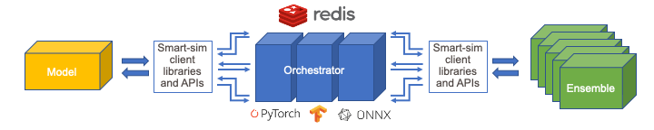

***********
Experiments
***********

The Experiment acts as both a factory function as well as an interface to interact
with the entities created by the experiment.

The interface was designed to be simple with as little complexity
as possible, and agnostic to the backend launching mechanism (local,
Slurm, PBSPro, etc).

|SmartSim Architecture|

Entities
========

Model
=====

``Model(s)`` are created through the Experiment API. Models represent
any computational kernel. Models are flexible enough to support many
different applications, however, to be used with our clients (SmartRedis)
the application will have to be written in Python, C, C++, or Fortran.

Models are given ``RunSettings`` objects that specify how a kernel should
be excuted with regards to the workload manager (e.g. Slurm) and the available
compute resources on the system.

Each launcher supports specific types of ``RunSettings``.

   - ``SrunSettings`` for Slurm
   - ``AprunSettings`` for PBSPro and Cobalt
   - ``MpirunSettings`` for OpenMPI with `mpirun` on PBSPro, Cobalt, and Slurm

When on systems that support these launch binaries, ``Model`` objects can
be created to run applications in allocations obtained by the user, or in the
case of Slurm based systems, SmartSim can obtain allocations before launching
``Model`` instances.

Ensemble
--------

In addition to a single model, SmartSim has the ability to launch an
``Ensemble`` of ``Model`` applications simultaneously. An ``Ensemble`` can be
constructed in three ways:
  1. Manually (by adding created ``Model`` objects)
  2. By generating permutations of model parameters
  3. By specifying a number of replicas

Ensembles can be given parameters and ``permutation strategies`` that
define how the Ensemble will create the underlying model objects.
Three strategies are built in
  1. ``all_perm`` for generating all permutations of model parameters
  2. ``step`` for creating one set of parameters for each element in `n` arrays
  3. ``random`` for random selection from predefined parameter spaces.

User-defined character tags in provided configuration files (e.g. Fortran namelists or XML)
can be replaced (copied and written) with assigned parameter values.

Launching Ensembles
-------------------

Ensembles can be launched in previously obtained interactive allocations
and as a batch. Similar to ``RunSettings``, ``BatchSettings`` specify how
a application(s) in a batch job should be executed with regards to the system
workload manager and available compute resources.

  - ``SBatchSettings`` for Slurm
  - ``QsubBatchSettings`` for PBSPro
  - ``CobaltBatchSettings`` for Cobalt

Users can specify how to execute ``Ensemble`` instances they
have created through the ``Experiment`` interface.

# TODO provide examples
To expand parameters into ``Model`` instances using permutation strategies
    - ``run_settings`` and ``params``

To create replicas of ``Model`` instances with the same ``RunSettings``
  - ``run_settings`` and ``replicas``

For running and ``Ensemble`` on systems with a workload manager/scheduler
like Slurm, or PBSPro, the following examples show how to create
``Ensembles`` that will launch as a batch job.

To create an empty ``Ensemble`` to add ``Model`` objects to that launches
as a batch job
  - ``batch_settings``

Specify batch parameters for entire ``Ensemble`` and run parameters for
each ``Model`` created as a result of parameter expansion
  - ``batch_settings``, ``run_settings``, and ``params``

Specify batch parameters for entire ``Ensemble`` and run parameters for
each replica model created ``Model``
  - ``batch_settings``, ``run_settings``, and ``replicas``

Orchestrator
------------

#TODO touch up
The Orchestrator is an in-memory database, clustered or standalone, that
is launched prior to the simulation. The Orchestrator can be used
to store and retrieve data stored in memory during the course of
an experiment. In order to stream data into the orchestrator or
receive data from the orchestrator, one of the SmartSim clients
has to be used within a ``Model``.

The use of an in-memory, distributed database to store data is one
of the key components of SmartSim that allows for scalable simulation
and analysis workloads. The inclusion of an in-memory database
provides data persistence so that the data can be accessed at any time
during or after the SmartSim experiment.

For more information on the Orchestrator, please see the Orchestrator
documentation section.
