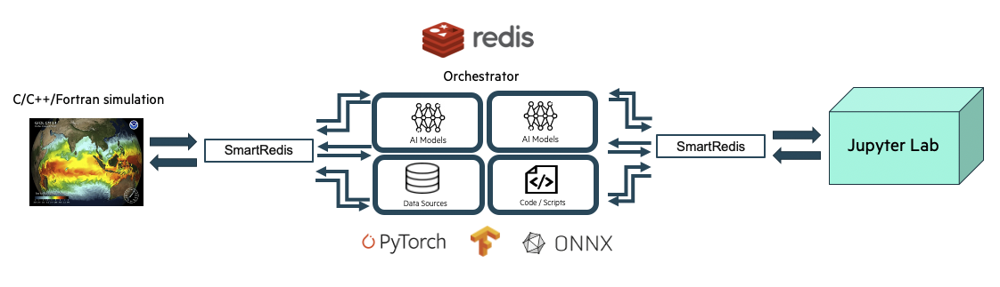
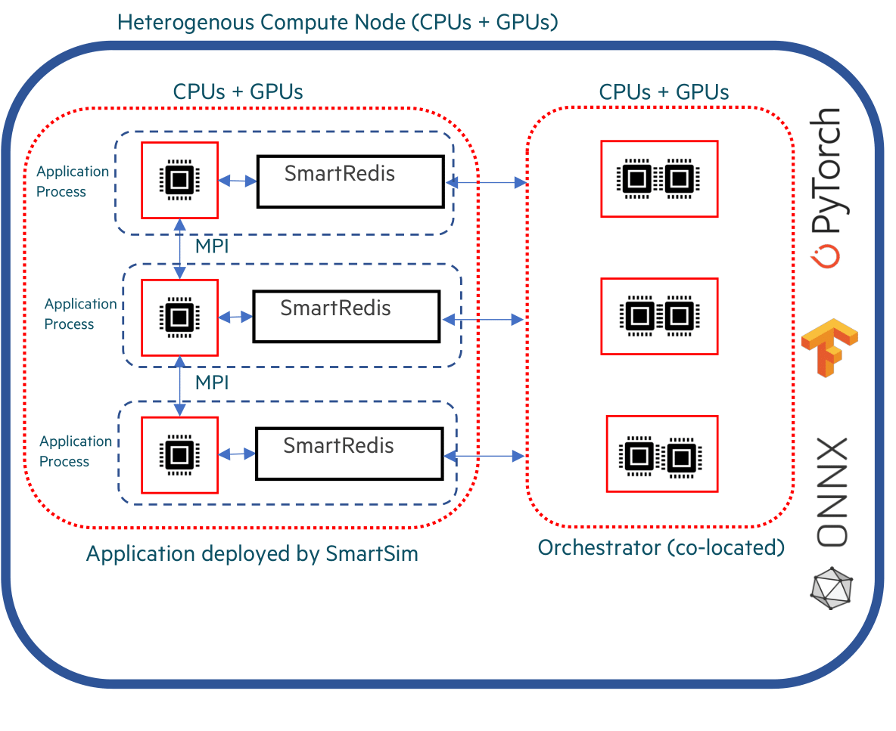

.. _orch_docs:

************
Orchestrator
************
========
Overview
========
The ``Orchestrator`` is an in-memory database with features built for
AI-enabled workflows including online training, low-latency inference, cross-application data
exchange, online interactive visualization, online data analysis, computational steering, and more.

An ``Orchestrator`` can be thought of as a general feature store
capable of storing numerical data (tensors and ``Datasets``), AI models (TF, TF-lite, PyTorch, or ONNX),
and scripts (TorchScripts). In addition to storing data, the ``Orchestrator`` is capable of
executing AI models and TorchScripts on the stored data using CPUs or GPUs.

  Sample ``Experiment`` showing a user application leveraging
  machine learning infrastructure launched by SmartSim and connected
  to an online analysis and visualization simulation via the ``Orchestrator``.

Users can establish a connection to the ``Orchestrator`` from within ``Model`` executable code, ``Ensemble``
member executable code, or ``Experiment`` driver scripts by using the
:ref:`SmartRedis<smartredis-api>` ``Client`` library.

SmartSim offers **two** types of ``Orchestrator`` deployments:

- :ref:`Standalone Deployment<standalone_orch_doc>`
   A standalone ``Orchestrator`` is ideal for systems that have heterogeneous node types
   (i.e. a mix of CPU-only and GPU-enabled compute nodes) where
   ML model and TorchScript evaluation is more efficiently performed off-node. This
   deployment is also ideal for workflows relying on data exchange between multiple
   applications (e.g. online analysis, visualization, computational steering, or
   producer/consumer application couplings). Standalone deployment is also optimal for
   high data throughput scenarios where ``Orchestrators`` require large amounts of compute resources.

- :ref:`Colocated Deployment<colocated_orch_doc>`
    A colocated ``Orchestrator`` is ideal when the data and hardware accelerator are located on the same compute node.
    This setup helps reduce latency in ML inference and TorchScript evaluation by eliminating off-node communication.

.. warning::
  Colocated ``Orchestrators`` cannot share data across compute nodes.
  Communication is only supported between a ``Model`` and colocated ``Orchestrator`` pair.

SmartSim allows users to launch :ref:`multiple Orchestrators<mutli_orch_doc>` of either type during
the course of an ``Experiment``. If a workflow requires a multiple ``Orchestrator`` environment, a
`db_identifier` argument must be specified during ``Orchestrator`` initialization. Users can connect to
``Orchestrators`` in a multiple ``Orchestrator`` workflow by specifying the respective `db_identifier` argument
within a :ref:`ConfigOptions<config_options_explain>` object that is passed into the SmartRedis ``Client`` constructor.

.. _standalone_orch_doc:

=====================
Standalone Deployment
=====================
--------
Overview
--------
During standalone ``Orchestrator`` deployment, a SmartSim ``Orchestrator`` (the database) runs on separate
compute node(s) from the SmartSim ``Model`` node(s). A standalone ``Orchestrator`` can be deployed on a single
node (single-sharded) or distributed (sharded) over multiple nodes. With a multi-node ``Orchestrator``, users can
scale the number of database nodes for inference and script evaluation, enabling
increased in-memory capacity for data storage in large-scale workflows. Single-node
``Orchestrators`` are effective for small-scale workflows and offer lower latency for ``Client`` API calls
that involve data appending or processing (e.g. ``Client.append_to_list``, ``Client.run_model``, etc).

When connecting to a standalone ``Orchestrator`` from within a ``Model`` application, the user has
several options to connect a SmartRedis ``Client``:

- In an ``Experiment`` with a single deployed ``Orchestrator``, users can rely on SmartRedis
  to detect the ``Orchestrator`` address through runtime configuration of the SmartSim ``Model`` environment.
  A default ``Client`` constructor, with no user-specified parameters, is sufficient to
  connect to the ``Orchestrator``. The only exception is for the Python ``Client``, which requires
  the `cluster` constructor parameter to differentiate between standalone deployment and colocated
  deployment.
- In an ``Experiment`` with multiple ``Orchestrators``, users can connect to a specific ``Orchestrator`` by
  first specifying the `db_identifier` in the ``ConfigOptions`` constructor within the executable application.
  Subsequently, users should pass the ``ConfigOptions`` instance to the ``Client`` constructor.
- Users can specify or override automatically configured connection options by providing the
  ``Orchestrator`` address in the ``ConfigOptions`` object. Subsequently, users should pass the ``ConfigOptions``
  instance to the ``Client`` constructor.

If connecting to a standalone ``Orchestrator`` from a ``Experiment`` driver script, the user must specify
the address of the ``Orchestrator`` to the ``Client`` constructor. SmartSim does not automatically
configure the environment of the ``Experiment`` driver script to connect to an ``Orchestrator``. Users
can access an ``Orchestrators`` address through ``Orchestrator.get_address``.

.. note::
  In SmartSim ``Model`` applications, it is advisable to **avoid** specifying addresses directly to the ``Client`` constructor.
  Utilizing the SmartSim environment configuration for SmartRedis ``Client`` connections
  allows the SmartSim ``Model`` application code to remain unchanged even as ``Orchestrator`` deployment
  options vary.

The following image illustrates
communication between a standalone ``Orchestrator`` and a
SmartSim ``Model``. In the diagram, the application is running on multiple compute nodes,
separate from the ``Orchestrator`` compute nodes. Communication is established between the
``Model`` application and the sharded ``Orchestrator`` using the :ref:`SmartRedis client<smartredis-api>`.

.. figure::  images/clustered_orchestrator-1.png

  Sample Standalone ``Orchestrator`` Deployment

.. note::
  Users do not need to know how the data is stored in a standalone configuration and
  can address the cluster with the SmartRedis ``Client`` like a single block of memory
  using simple put/get semantics in SmartRedis.

In scenarios where data needs to be shared amongst ``Experiment`` entities,
such as online analysis, training, and processing, a standalone ``Orchestrator``
is optimal. The data produced by multiple processes in a ``Model`` is stored in the standalone
``Orchestrator`` and is available for consumption by other ``Model``'s.

If a workflow requires an application to leverage multiple standalone deployments,
multiple ``Clients`` can be instantiated within an application,
with each ``Client`` connected to a unique ``Orchestrator``. This is accomplished through the use of the
`db-identifier` and :ref:`ConfigOptions<config_options_explain>` object specified at ``Orchestrator`` initialization time.
For more information on a multiple database ``Experiment``, visit the :ref:`Multiple Orchestrators<mutli_orch>` section on
this page.

-------
Example
-------
In the following example, we demonstrate deploying a standalone ``Orchestrator`` on an HPC system.
Once the standalone ``Orchestrator`` is launched from the ``Experiment`` driver script, we walk through
connecting a SmartRedis ``Client`` to the ``Orchestrator`` from within the ``Model``
application to transmit and poll for data.

The example is comprised of two script files:

- :ref:`Application Script<standalone_orch_app_script>`
   The application script is a Python file that contains instructions to create a SmartRedis
   ``Client`` connection to the standalone ``Orchestrator``. To demonstrate the ability of
   workflow components to access data from other entities, we retrieve the tensors set by
   the driver script using a SmartRedis ``Client`` in the application script. We then instruct
   the ``Client`` to send and retrieve data from within the application script. The example source
   code is available in the dropdown below for convenient execution and customization.

   .. dropdown:: Example Application Script source code

       .. literalinclude:: tutorials/doc_examples/orch_examples/std_app.py

- :ref:`Experiment Driver Script<standalone_orch_driver_script>`
   The ``Experiment`` driver script is responsible for launching and managing SmartSim entities. Within this script,
   we use the ``Experiment`` API to create and launch a standalone ``Orchestrator``. To demonstrate the capability of
   a ``Model`` application to access ``Orchestrator`` data sent from other sources, we employ the SmartRedis ``Client`` in
   the driver script to store a tensor in the ``Orchestrator``, which is later retrieved by the ``Model`` application.
   To employ the application script, we initialize a ``Model`` object with the application script as the executable,
   launch the ``Orchestrator``, and then launch the ``Model``.

   To further demonstrate the ability of workflow components to access data from
   other entities, we retrieve the tensors stored by the completed ``Model`` using a SmartRedis ``Client`` in
   the driver script. Lastly, we tear down the ``Orchestrator``. The example source code is available in the dropdown below for
   convenient execution and customization.

   .. dropdown:: Example Experiment Driver Script Source Code

       .. literalinclude:: tutorials/doc_examples/orch_examples/std_driver.py

.. _standalone_orch_app_script:

Application Script
==================
To begin writing the application script, import the necessary SmartRedis packages:

.. literalinclude:: tutorials/doc_examples/orch_examples/std_app.py
    :language: python
    :linenos:
    :lines: 1-2

Client Initialization
---------------------
To establish a connection with the ``Orchestrator``, we need to initialize a new SmartRedis ``Client``.
Because the ``Orchestrator`` launched in the driver script is sharded, we specify the
constructor argument `cluster` as `True`.

.. literalinclude:: tutorials/doc_examples/orch_examples/std_app.py
    :language: python
    :linenos:
    :lines: 4-5

.. note::
  Note that the C/C++/Fortran SmartRedis ``Clients`` are capable of reading cluster configurations
  from the SmartSim ``Model`` environment and the `cluster` constructor argument does not need to be specified
  in those ``Client`` languages.

Since there is only one ``Orchestrator`` launched in the ``Experiment``
(the standalone ``Orchestrator``), specifying an ``Orchestrator`` `db_identifier`
is **not** required when initializing the SmartRedis ``Client``.
SmartRedis will handle the connection configuration.

.. note::
   To create a SmartRedis ``Client`` connection to the standalone ``Orchestrator``, the ``Orchestrator`` must be launched
   from within the driver script prior to the start of the ``Model``.

Data Retrieval
--------------
To confirm a successful connection to the ``Orchestrator``, we retrieve the tensor set from the ``Experiment`` script.
Use the ``Client.get_tensor`` method to retrieve the tensor named `tensor_1` placed by the driver script:

.. literalinclude:: tutorials/doc_examples/orch_examples/std_app.py
    :language: python
    :linenos:
    :lines: 7-10

After the ``Model`` is launched by the driver script, the following output will appear in
`getting-started/model/model.out`::

  Default@17-11-48:The multi-sharded db tensor is: [1 2 3 4]

Data Storage
------------
Next, create a NumPy tensor to send to the standalone ``Orchestrator`` using
``Client.put_tensor(name, data)``:

.. literalinclude:: tutorials/doc_examples/orch_examples/std_app.py
    :language: python
    :linenos:
    :lines: 12-15

We retrieve `"tensor_2"` in the ``Experiment`` driver script.

.. _standalone_orch_driver_script:

Experiment Driver Script
========================
To run the previous application script, we define a ``Model`` and ``Orchestrator`` within the
``Experiment`` driver script. Configuring and launching workflow entities (``Model`` and ``Orchestrator``) requires the utilization of
``Experiment`` class methods. The ``Experiment`` object is intended to be instantiated
once and utilized throughout the workflow runtime.

In this example, we instantiate an ``Experiment`` object with the name `getting-started`
and the `launcher` set to `auto`. When using `launcher=auto`, SmartSim attempts to find a launcher on the machine.
For example, if this script were run on a Slurm-based system, SmartSim will automatically set the launcher to `slurm`.
We also setup the SmartSim `logger` to output information from the ``Experiment`` at runtime:

.. literalinclude:: tutorials/doc_examples/orch_examples/std_driver.py
    :language: python
    :linenos:
    :lines: 1-9

Orchestrator Initialization
---------------------------
In the next stage of the ``Experiment``, we create a standalone ``Orchestrator``.

To create a standalone ``Orchestrator``, utilize the ``Experiment.create_database`` function:

.. literalinclude:: tutorials/doc_examples/orch_examples/std_driver.py
    :language: python
    :linenos:
    :lines: 11-12

Client Initialization
---------------------
The SmartRedis ``Client`` object contains functions that manipulate, send, and retrieve
data on the ``Orchestrator``. Begin by initializing a SmartRedis ``Client`` object for the standalone ``Orchestrator``.

SmartRedis ``Clients`` in driver scripts do not have the ability to use a `db-identifier` or
rely on automatic configurations to connect to ``Orchestrators``. Therefore, when creating a SmartRedis ``Client``
connection from within a driver script, specify the address of the ``Orchestrator`` you would like to connect to.
You can easily retrieve the ``Orchestrator`` address using the ``Orchestrator.get_address`` function:

.. literalinclude:: tutorials/doc_examples/orch_examples/std_driver.py
    :language: python
    :linenos:
    :lines: 14-15

Data Storage
------------
In the application script, we retrieved a NumPy tensor stored from within the driver script.
To support the application functionality, we create a
NumPy array in the ``Experiment`` driver script to send to the ``Orchestrator``. To
send a tensor to the ``Orchestrator``, use the function ``Client.put_tensor(name, data)``:

.. literalinclude:: tutorials/doc_examples/orch_examples/std_driver.py
    :language: python
    :linenos:
    :lines: 17-20

Model Initialization
--------------------
In the next stage of the ``Experiment``, we configure and create
a SmartSim ``Model`` and specify the executable path during ``Model`` creation:

.. literalinclude:: tutorials/doc_examples/orch_examples/std_driver.py
    :language: python
    :linenos:
    :lines: 22-27

File Generation
---------------
To create an isolated output directory for the ``Orchestrator`` and ``Model``, invoke ``Experiment.generate`` on the
``Experiment`` instance `exp` with `standalone_orchestrator` and `model` as input parameters:

.. literalinclude:: tutorials/doc_examples/orch_examples/std_driver.py
    :language: python
    :linenos:
    :lines: 29-30

Invoking ``Experiment.generate(standalone_orchestrator, model)`` will create two directories:
`standalone_orchestrator/` and `model/`. Each of these directories will store
two output files: a `.out` file and a `.err` file.

.. note::
  It is important to invoke ``Experiment.generate`` with all ``Experiment`` entity instances
  before launching. This will ensure that the output files are organized in the main ``experiment-name/``
  folder. In this example, the ``Experiment`` folder is named `getting-started/`.

Entity Deployment
-----------------
In the next stage of the ``Experiment``, we launch the ``Orchestrator``, then launch the ``Model``.

Step 1: Start Orchestrator
''''''''''''''''''''''''''
In the context of this ``Experiment``, it's essential to create and launch
the ``Orchestrator`` as a preliminary step before any other workflow entities. This is important
because the application requests and sends tensors to a launched ``Orchestrator``.

To launch the ``Orchestrator``, pass the ``Orchestrator`` instance to ``Experiment.start``.

.. literalinclude:: tutorials/doc_examples/orch_examples/std_driver.py
    :language: python
    :linenos:
    :lines: 32-33

The ``Experiment.start`` function launches the ``Orchestrator`` for use within the workflow.
In other words, the function deploys the ``Orchestrator`` on the allocated compute resources.

Step 2: Start Model
'''''''''''''''''''
Next, launch the `model` instance using the ``Experiment.start`` function:

.. literalinclude:: tutorials/doc_examples/orch_examples/std_driver.py
    :language: python
    :linenos:
    :lines: 35-36

In the next subsection, we request tensors placed by the ``Model`` application.
We specify `block=True` to ``exp.start`` to require the ``Model`` to finish before
the ``Experiment`` continues.

Data Polling
------------
Next, check if the tensor exists in the standalone ``Orchestrator`` using ``Client.poll_tensor``.
This function queries for data in the ``Orchestrator``. The function requires the tensor name (`name`),
how many milliseconds to wait in between queries (`poll_frequency_ms`),
and the total number of times to query (`num_tries`). Check if the data exists in the ``Orchestrator`` by
polling every 100 milliseconds until 10 attempts have completed:

.. literalinclude:: tutorials/doc_examples/orch_examples/std_driver.py
    :language: python
    :linenos:
    :lines: 38-41

When you execute the driver script, the output will be as follows::

  23:45:46 system.host.com SmartSim[87400] INFO The tensor exists: True

Cleanup
-------
Finally, use the ``Experiment.stop`` function to stop the ``Orchestrator`` instance. Print the
workflow summary with ``Experiment.summary``:

.. literalinclude:: tutorials/doc_examples/orch_examples/std_driver.py
    :language: python
    :linenos:
    :lines: 43-46

When you run the ``Experiment``, the following output will appear::

  |    | Name           | Entity-Type   | JobID       | RunID   | Time    | Status    | Returncode   |
  |----|----------------|---------------|-------------|---------|---------|-----------|--------------|
  | 0  | model          | Model         | 1658679.3   | 0       | 1.3342  | Completed | 0            |
  | 1  | orchestrator_0 | DBNode        | 1658679.2+2 | 0       | 42.8742 | Cancelled | 0            |

.. _colocated_orch_doc:

====================
Colocated Deployment
====================
--------
Overview
--------
During colocated ``Orchestrator`` deployment, a SmartSim ``Orchestrator`` (the database) runs on
the ``Model``'s compute node(s). Colocated ``Orchestrators`` can only be deployed as isolated instances
on each compute node and cannot be clustered over multiple nodes. The ``Orchestrator`` on each application node is
utilized by SmartRedis ``Clients`` on the same node. With a colocated ``Orchestrator``, all interactions
with the database occur on the same node, thus resulting in lower latency compared to the standard ``Orchestrator``.
A colocated ``Orchestrator`` is ideal when the data and hardware accelerator are located on the
same compute node.

Communication between a colocated ``Orchestrator`` and ``Model`` is initiated in the application through a
SmartRedis ``Client``. Since a colocated ``Orchestrator`` is launched when the ``Model``
is started by the ``Experiment``, connecting a SmartRedis ``Client`` to a colocated ``Orchestrator`` is only possible from within
the associated ``Model`` application.

There are **three** methods for connecting the SmartRedis ``Client`` to the colocated ``Orchestrator``:

- In an ``Experiment`` with a single deployed ``Orchestrator``, users can rely on SmartRedis
  to detect the ``Orchestrator`` address through runtime configuration of the SmartSim ``Model`` environment.
  A default ``Client`` constructor, with no user-specified parameters, is sufficient to
  connect to the ``Orchestrator``. The only exception is for the Python ``Client``, which requires
  the `cluster=False` constructor parameter for the colocated ``Orchestrator``.
- In an ``Experiment`` with multiple ``Orchestrators``, users can connect to a specific ``Orchestrator`` by
  first specifying the `db_identifier` in the ``ConfigOptions`` constructor. Subsequently, users should pass the
  ``ConfigOptions`` instance to the ``Client`` constructor.
- Users can specify or override automatically configured connection options by providing the
  ``Orchestrator`` address in the ``ConfigOptions`` object. Subsequently, users should pass the ``ConfigOptions``
  instance to the ``Client`` constructor.

Below is an image illustrating communication within a colocated ``Model`` spanning multiple compute nodes.
As demonstrated in the diagram, each process of the application creates its own SmartRedis ``Client``
connection to the ``Orchestrator`` running on the same host.

  Sample Colocated ``Orchestrator`` Deployment

Colocated deployment is ideal for highly performant online inference scenarios where
a distributed application (likely an MPI application) is performing inference with
data local to each process. With colocated deployment, data does not need to travel
off-node to be used to evaluate a ML model, and the results of the ML model evaluation
are stored on-node.

If a workflow requires an application to both leverage colocated
deployment and standalone deployment, multiple ``Clients`` can be instantiated within an application,
with each ``Client`` connected to a unique deployment. This is accomplished through the use of the
`db-identifier` specified at ``Orchestrator`` initialization time.

-------
Example
-------
In the following example, we demonstrate deploying a colocated ``Orchestrator`` on an HPC system.
Once the ``Orchestrator`` is launched, we walk through connecting a SmartRedis ``Client``
from within the application script to transmit and poll for data on the ``Orchestrator``.

The example is comprised of two script files:

- :ref:`Application Script<colocated_orch_app_script>`
   The application script is a Python script that connects a SmartRedis
   ``Client`` to the colocated ``Orchestrator``. From within the application script,
   the ``Client`` is utilized to both send and retrieve data. The source code example
   is available in the dropdown below for convenient execution and customization.

   .. dropdown:: Example Application Script Source Code

       .. literalinclude:: tutorials/doc_examples/orch_examples/colo_app.py

- :ref:`Experiment Driver Script<colocated_orch_driver_script>`
   The ``Experiment`` driver script launches and manages
   the example entities through the ``Experiment`` API.
   In the driver script, we use the ``Experiment`` API
   to create and launch a colocated ``Model``. The source code example is available
   in the dropdown below for convenient execution and customization.

   .. dropdown:: Example Experiment Driver source code

       .. literalinclude:: tutorials/doc_examples/orch_examples/colo_driver.py

.. _colocated_orch_app_script:

Application Script
==================
To begin writing the application script, import the necessary SmartRedis packages:

.. literalinclude:: tutorials/doc_examples/orch_examples/colo_app.py
    :language: python
    :linenos:
    :lines: 1-2

Client Initialization
---------------------
To establish a connection with the colocated ``Orchestrator``, we need to initialize a
new SmartRedis ``Client`` and specify `cluster=False` since colocated deployments are never
clustered but only single-sharded.

.. literalinclude:: tutorials/doc_examples/orch_examples/colo_app.py
    :language: python
    :linenos:
    :lines: 4-5

.. note::
  Note that the C/C++/Fortran SmartRedis ``Clients`` are capable of reading cluster configurations
  from the ``Model`` environment and the `cluster` constructor argument does not need to be specified
  in those ``Client`` languages.

.. note::
    Since there is only one ``Orchestrator`` launched in the ``Experiment``
    (the colocated ``Orchestrator``), specifying a ``Orchestrator`` `db_identifier`
    is not required when initializing the ``Client``. SmartRedis will handle the
    connection configuration.

.. note::
   To create a ``Client`` connection to the colocated ``Orchestrator``, the colocated ``Model`` must be launched
   from within the driver script. You must execute the Python driver script, otherwise, there will
   be no ``Orchestrator`` to connect the ``Client`` to.

Data Storage
------------
Next, using the SmartRedis ``Client`` instance, we create and store a NumPy tensor through
``Client.put_tensor(name, data)``:

.. literalinclude:: tutorials/doc_examples/orch_examples/colo_app.py
    :language: python
    :linenos:
    :lines: 7-10

We will retrieve `“tensor_1”` in the following section.

Data Retrieval
--------------
To confirm a successful connection to the ``Orchestrator``, we retrieve the tensor we stored.
Use the ``Client.get_tensor`` method to retrieve the tensor by specifying the name
`“tensor_1”`:

.. literalinclude:: tutorials/doc_examples/orch_examples/colo_app.py
    :language: python
    :linenos:
    :lines: 12-15

When the ``Experiment`` completes, you can find the following log message in `colo_model.out`::

    Default@21-48-01:The colocated db tensor is: [1 2 3 4]

.. _colocated_orch_driver_script:

Experiment Driver Script
========================
To run the previous application script, a ``Model`` object must be configured and launched within the
``Experiment`` driver script. Configuring and launching workflow entities (``Model``)
requires the utilization of ``Experiment`` class methods. The ``Experiment`` object is intended to
be instantiated once and utilized throughout the workflow runtime.

In this example, we instantiate an ``Experiment`` object with the name `getting-started`
and the `launcher` set to `auto`. When using `launcher=auto`, SmartSim attempts to find a launcher on the machine.
In this case, since we are running the example on a Slurm-based machine,
SmartSim will automatically set the launcher to `slurm`. We set up the SmartSim `logger`
to output information from the ``Experiment`` at runtime:

.. literalinclude:: tutorials/doc_examples/orch_examples/colo_driver.py
    :language: python
    :linenos:
    :lines: 1-9

Colocated Model Initialization
------------------------------
In the next stage of the ``Experiment``, we create and launch a colocated ``Model`` that
runs the application script with a ``Orchestrator`` on the same compute node.

Step 1: Configure
'''''''''''''''''
In this example ``Experiment``, the ``Model`` application is a Python script as defined in section:
:ref:`Application Script<colocated_orch_app_script>`. Before initializing the ``Model`` object, we must use
``Experiment.create_run_settings`` to create a ``RunSettings`` object that defines how to execute
the ``Model``. To launch the Python script in this example workflow, we specify the path to the application
file `application_script.py` as the `exe_args` parameter and the executable `exe_ex` (the Python
executable on this system) as `exe` parameter. The ``Experiment.create_run_settings`` function
will return a ``RunSettings`` object that can then be used to initialize the ``Model`` object.

.. note::
  Change the `exe_args` argument to the path of the application script
  on your file system to run the example.

Use the ``RunSettings`` helper functions to
configure the the distribution of computational tasks (``RunSettings.set_nodes``). In this
example, we specify to SmartSim that we intend the ``Model`` to run on a single compute node.

.. literalinclude:: tutorials/doc_examples/orch_examples/colo_driver.py
    :language: python
    :linenos:
    :lines: 11-14

Step 2: Initialize
''''''''''''''''''
Next, create a ``Model`` instance using the ``Experiment.create_model`` factory method.
Pass the ``model_settings`` object as input to the method and
assign the returned ``Model`` instance to the variable `model`:

.. literalinclude:: tutorials/doc_examples/orch_examples/colo_driver.py
    :language: python
    :linenos:
    :lines: 16-17

Step 3: Colocate
''''''''''''''''
To colocate an ``Orchestrator`` with a ``Model``, use the ``Model.colocate_db_uds`` function.
This function will colocate an ``Orchestrator`` instance with this ``Model`` over
a Unix domain socket connection.

.. literalinclude:: tutorials/doc_examples/orch_examples/colo_driver.py
    :language: python
    :linenos:
    :lines: 19-20

Step 4: Generate Files
''''''''''''''''''''''
Next, generate the ``Experiment`` entity directories by passing the ``Model`` instance to
``Experiment.generate``:

.. literalinclude:: tutorials/doc_examples/orch_examples/colo_driver.py
    :language: python
    :linenos:
    :lines: 22-23

Step 5: Start
'''''''''''''
Next, launch the colocated ``Model`` instance using the ``Experiment.start`` function.

.. literalinclude:: tutorials/doc_examples/orch_examples/colo_driver.py
    :language: python
    :linenos:
    :lines: 25-26

Cleanup
-------
.. note::
  Since the colocated ``Orchestrator`` is automatically torn down by SmartSim once the colocated ``Model``
  has finished, we do not need to `stop` the ``Orchestrator``.

.. literalinclude:: tutorials/doc_examples/orch_examples/colo_driver.py
    :language: python
    :linenos:
    :lines: 28-29

When you run the experiment, the following output will appear::

  |    | Name   | Entity-Type   | JobID     | RunID   | Time    | Status    | Returncode   |
  |----|--------|---------------|-----------|---------|---------|-----------|--------------|
  | 0  | model  | Model         | 1592652.0 | 0       | 10.1039 | Completed | 0            |

.. _mutli_orch_doc:

======================
Multiple Orchestrators
======================
SmartSim supports automating the deployment of multiple ``Orchestrators``
from within an ``Experiment``. Communication with the ``Orchestrator`` via a SmartRedis ``Client`` is possible with the
`db_identifier` argument that is required when initializing an ``Orchestrator`` or
colocated ``Model`` during a multiple ``Orchestrator`` ``Experiment``. When initializing a SmartRedis
``Client`` during the ``Experiment``, create a ``ConfigOptions`` object to specify the `db_identifier`
argument used when creating the ``Orchestrator``. Pass the ``ConfigOptions`` object to
the ``Client`` init call.

.. _mutli_orch:

-----------------------------
Multiple Orchestrator Example
-----------------------------
SmartSim offers functionality to automate the deployment of multiple
databases, supporting workloads that require multiple
``Orchestrators`` for a ``Experiment``. For instance, a workload may consist of a
simulation with high inference performance demands (necessitating a co-located deployment),
along with an analysis and visualization workflow connected to the simulation
(requiring a standalone ``Orchestrator``). In the following example, we simulate a
simple version of this use case.

The example is comprised of two script files:

* The Application Script
* The ``Experiment`` Driver Script

**The Application Script Overview:**
In this example, the application script is a python file that
contains instructions to complete computational
tasks. Applications are not limited to Python
and can also be written in C, C++ and Fortran.
This script specifies creating a Python SmartRedis ``Client`` for each
standalone ``Orchestrator`` and a colocated ``Orchestrator``. We use the
``Clients`` to request data from both standalone ``Orchestrators``, then
transfer the data to the colocated ``Orchestrator``. The application
file is launched by the ``Experiment`` driver script
through a ``Model`` stage.

**The Application Script Contents:**

1. Connecting SmartRedis ``Clients`` within the application to retrieve tensors
   from the standalone ``Orchestrators`` to store in a colocated ``Orchestrator``. Details in section:
   :ref:`Initialize the Clients<init_model_client>`.

**The Experiment Driver Script Overview:**
The ``Experiment`` driver script holds the stages of the workflow
and manages their execution through the ``Experiment`` API.
We initialize an ``Experiment``
at the beginning of the Python file and use the ``Experiment`` to
iteratively create, configure and launch computational kernels
on the system through the `slurm` launcher.
In the driver script, we use the ``Experiment`` to create and launch a ``Model`` instance that
runs the application.

**The Experiment Driver Script Contents:**

1. Launching two standalone ``Orchestrators`` with unique identifiers. Details in section:
   :ref:`Launch Multiple Orchestrators<launch_multiple_orch>`.
2. Launching the application script with a colocated ``Orchestrator``. Details in section:
   :ref:`Initialize a Colocated Model<init_colocated_model>`.
3. Connecting SmartRedis ``Clients`` within the driver script to send tensors to standalone ``Orchestrators``
   for retrieval within the application. Details in section:
   :ref:`Create Client Connections to Orchestrators<client_connect_orch>`.

Setup and run instructions can be found :ref:`here<run_ex_instruct>`

.. _app_script_multi_db:

The Application Script
======================
Applications interact with the ``Orchestrators``
through a SmartRedis ``Client``.
In this section, we write an application script
to demonstrate how to connect SmartRedis
``Clients`` in the context of multiple
launched ``Orchestrators``. Using the ``Clients``, we retrieve tensors
from two ``Orchestrators`` launched in the driver script, then store
the tensors in the colocated ``Orchestrators``.

.. note::
   The ``Experiment`` must be started to use the ``Orchestrators`` within the
   application script.  Otherwise, it will fail to connect.
   Find the instructions on how to launch :ref:`here<run_ex_instruct>`

To begin, import the necessary packages:

.. literalinclude:: tutorials/getting_started/multi_db_example/application_script.py
  :language: python
  :linenos:
  :lines: 1-3

.. _init_model_client:

Initialize the Clients
----------------------
To establish a connection with each ``Orchestrators``,
we need to initialize a new SmartRedis ``Client`` for each.

Step 1: Initialize ConfigOptions
''''''''''''''''''''''''''''''''
Since we are launching multiple ``Orchestrators`` within the ``Experiment``,
the SmartRedis ``ConfigOptions`` object is required when initializing
a ``Client`` in the application.
We use the ``ConfigOptions.create_from_environment``
function to create three instances of ``ConfigOptions``,
with one instance associated with each launched ``Orchestrator``.
Most importantly, to associate each launched ``Orchestrator`` to a ``ConfigOptions`` object,
the ``create_from_environment`` function requires specifying the unique ``Orchestrator`` identifier
argument named `db_identifier`.

For the single-sharded ``Orchestrator``:

.. literalinclude:: tutorials/getting_started/multi_db_example/application_script.py
  :language: python
  :linenos:
  :lines: 5-6

For the multi-sharded ``Orchestrator``:

.. literalinclude:: tutorials/getting_started/multi_db_example/application_script.py
  :language: python
  :linenos:
  :lines: 10-11

For the colocated ``Orchestrator``:

.. literalinclude:: tutorials/getting_started/multi_db_example/application_script.py
  :language: python
  :linenos:
  :lines: 15-16

Step 2: Initialize the Client Connections
'''''''''''''''''''''''''''''''''''''''''
Now that we have three ``ConfigOptions`` objects, we have the
tools necessary to initialize three SmartRedis ``Clients`` and
establish a connection with the three ``Orchestrators``.
We use the SmartRedis ``Client`` API to create the ``Client`` instances by passing in
the ``ConfigOptions`` objects and assigning a `logger_name` argument.

Single-sharded ``Orchestrator``:

.. literalinclude:: tutorials/getting_started/multi_db_example/application_script.py
  :language: python
  :linenos:
  :lines: 7-8

Multi-sharded ``Orchestrator``:

.. literalinclude:: tutorials/getting_started/multi_db_example/application_script.py
  :language: python
  :linenos:
  :lines: 12-13

Colocated ``Orchestrator``:

.. literalinclude:: tutorials/getting_started/multi_db_example/application_script.py
  :language: python
  :linenos:
  :lines: 17-18

Retrieve Data and Store Using SmartRedis Client Objects
-------------------------------------------------------
To confirm a successful connection to each ``Orchestrator``, we will retrieve the tensors
that we plan to store in the python driver script. After retrieving, we
store both tensors in the colocated ``Orchestrator``.
The ``Client.get_tensor`` method allows
retrieval of a tensor. It requires the `name` of the tensor assigned
when sent to the ``Orchestrator`` via ``Client.put_tensor``.

.. literalinclude:: tutorials/getting_started/multi_db_example/application_script.py
  :language: python
  :linenos:
  :lines: 20-26

Later, when you run the ``Experiment`` driver script the following output will appear in ``tutorial_model.out``
located in ``getting-started-multidb/tutorial_model/``::

  Model: single shard logger@00-00-00:The single sharded db tensor is: [1 2 3 4]
  Model: multi shard logger@00-00-00:The multi sharded db tensor is: [5 6 7 8]

This output showcases that we have established a connection with multiple ``Orchestrators``.

Next, take the tensors retrieved from the standalone deployment ``Orchestrators`` and
store them in the colocated ``Orchestrator`` using  ``Client.put_tensor(name, data)``.

.. literalinclude:: tutorials/getting_started/multi_db_example/application_script.py
  :language: python
  :linenos:
  :lines: 28-30

Next, check if the tensors exist in the colocated ``Orchestrator`` using ``Client.poll_tensor``.
This function queries for data in the ``Orchestrator``. The function requires the tensor name (`name`),
how many milliseconds to wait in between queries (`poll_frequency_ms`),
and the total number of times to query (`num_tries`):

.. literalinclude:: tutorials/getting_started/multi_db_example/application_script.py
  :language: python
  :linenos:
  :lines: 32-37

The output will be as follows::

  Model: colo logger@00-00-00:The colocated db has tensor_1: True
  Model: colo logger@00-00-00:The colocated db has tensor_2: True

The Experiment Driver Script
============================
To run the previous application, we must define workflow stages within a workload.
Defining workflow stages requires the utilization of functions associated
with the ``Experiment`` object. The ``Experiment`` object is intended to be instantiated
once and utilized throughout the workflow runtime.
In this example, we instantiate an ``Experiment`` object with the name ``getting-started-multidb``.
We setup the SmartSim ``logger`` to output information from the Experiment.

.. literalinclude:: tutorials/getting_started/multi_db_example/multidb_driver.py
  :language: python
  :linenos:
  :lines: 1-10

.. _launch_multiple_orch:

Launch Multiple Orchestrators
-----------------------------
In the context of this ``Experiment``, it's essential to create and launch
the ``Orchestrators`` as a preliminary step before any other components since
the application script requests tensors from the launched ``Orchestrators``.

We aim to showcase the multi-Orchestrator automation capabilities of SmartSim, so we
create two ``Orchestrators`` in the workflow: a single-sharded ``Orchestrator`` and a
multi-sharded ``Orchestrator``.

Step 1: Initialize Orchestrators
''''''''''''''''''''''''''''''''
To create an ``Orchestrator``, utilize the ``Experiment.create_database`` function.
The function requires specifying a unique
``Orchestrator`` identifier argument named `db_identifier` to launch multiple ``Orchestrators``.
This step is necessary to connect to ``Orchestrators`` outside of the driver script.
We will use the `db_identifier` names we specified in the application script.

For the single-sharded ``Orchestrator``:

.. literalinclude:: tutorials/getting_started/multi_db_example/multidb_driver.py
  :language: python
  :linenos:
  :lines: 12-14

For the multi-sharded ``Orchestrator``:

.. literalinclude:: tutorials/getting_started/multi_db_example/multidb_driver.py
  :language: python
  :linenos:
  :lines: 16-18

.. note::
  Calling ``exp.generate`` will create two subfolders
  (one for each ``Orchestrator`` created in the previous step)
  whose names are based on the `db_identifier` of that ``Orchestrator``.
  In this example, the Experiment folder is
  named ``getting-started-multidb/``. Within this folder, two ``Orchestrator`` subfolders will
  be created, namely ``single_shard_db_identifier/`` and ``multi_shard_db_identifier/``.

Step 2: Start
'''''''''''''
Next, to launch the ``Orchestrators``,
pass the ``Orchestrator`` instances to ``Experiment.start``.

.. literalinclude:: tutorials/getting_started/multi_db_example/multidb_driver.py
  :language: python
  :linenos:
  :lines: 20-21

The ``Experiment.start`` function launches the ``Orchestrators`` for use within the workflow. In other words, the function
deploys the ``Orchestrators`` on the allocated compute resources.

.. note::
  By setting `summary=True`, SmartSim will print a summary of the
  ``Experiment`` before it is launched. After printing the ``Experiment`` summary,
  the ``Experiment`` is paused for 10 seconds giving the user time to
  briefly scan the summary contents. If we set `summary=False`, then the ``Experiment``
  would be launched immediately with no summary.

.. _client_connect_orch:

Create Client Connections to Orchestrators
------------------------------------------
The SmartRedis ``Client`` object contains functions that manipulate, send, and receive
data within the ``Orchestrator``. Each ``Orchestrator`` has a single, dedicated SmartRedis ``Client``.
Begin by initializing a SmartRedis ``Client`` object per launched ``Orchestrator``.

To create a designated SmartRedis ``Client``, you need to specify the address of the target
running ``Orchestrator``. You can easily retrieve this address using the ``Orchestrator.get_address`` function.

For the single-sharded ``Orchestrator``:

.. literalinclude:: tutorials/getting_started/multi_db_example/multidb_driver.py
  :language: python
  :linenos:
  :lines: 23-24

For the multi-sharded ``Orchestrator``:

.. literalinclude:: tutorials/getting_started/multi_db_example/multidb_driver.py
  :language: python
  :linenos:
  :lines: 25-26

Store Data Using Clients
------------------------
In the application script, we retrieved two NumPy tensors.
To support the apps functionality, we will create two
NumPy arrays in the python driver script and send them to the a ``Orchestrator``. To
accomplish this, we use the ``Client.put_tensor`` function with the respective
``Orchestrator`` `client` instances.

For the single-sharded ``Orchestrator``:

.. literalinclude:: tutorials/getting_started/multi_db_example/multidb_driver.py
  :language: python
  :linenos:
  :lines: 28-31

For the multi-sharded ``Orchestrator``:

.. literalinclude:: tutorials/getting_started/multi_db_example/multidb_driver.py
  :language: python
  :linenos:
  :lines: 33-36

Lets check to make sure the ``Orchestrator`` tensors do not exist in the incorrect ``Orchestrators``:

.. literalinclude:: tutorials/getting_started/multi_db_example/multidb_driver.py
  :language: python
  :linenos:
  :lines: 38-42

When you run the ``Experiment``, the following output will appear::

  00:00:00 system.host.com SmartSim[#####] INFO The multi shard array key exists in the incorrect database: False
  00:00:00 system.host.com SmartSim[#####] INFO The single shard array key exists in the incorrect database: False

.. _init_colocated_model:

Initialize a Colocated Model
----------------------------
In the next stage of the ``Experiment``, we
launch the application script with a co-located ``Orchestrator``
by configuring and creating
a SmartSim colocated ``Model``.

Step 1: Configure
'''''''''''''''''
You can specify the run settings of a ``Model``.
In this ``Experiment``, we invoke the Python interpreter to run
the python script defined in section: :ref:`The Application Script<app_script_multi_db>`.
To configure this into a SmartSim ``Model``, we use the ``Experiment.create_run_settings`` function.
The function returns a ``RunSettings`` object.
When initializing the RunSettings object,
we specify the path to the application file,
`application_script.py`, for
``exe_args``, and the run command for ``exe``.

.. literalinclude:: tutorials/getting_started/multi_db_example/multidb_driver.py
  :language: python
  :linenos:
  :lines: 44-45

.. note::
  You will have to change the `exe_args` argument to the path of the application script
  on your machine to run the example.

With the ``RunSettings`` instance,
configure the the distribution of computational tasks (``RunSettings.set_nodes``) and the number of instances
the script is execute on each node (``RunSettings.set_tasks_per_node``). In this
example, we specify to SmartSim that we intend to execute the script once on a single node.

.. literalinclude:: tutorials/getting_started/multi_db_example/multidb_driver.py
  :language: python
  :linenos:
  :lines: 46-48

Step 2: Initialize
''''''''''''''''''
Next, create a ``Model`` instance using the ``Experiment.create_model``.
Pass the ``model_settings`` object as an argument
to the ``create_model`` function and assign to the variable ``model``.

.. literalinclude:: tutorials/getting_started/multi_db_example/multidb_driver.py
  :language: python
  :linenos:
  :lines: 49-50

Step 2: Colocate
''''''''''''''''
To colocate the ``Model``, use the ``Model.colocate_db_uds`` function to
Colocate an ``Orchestrator`` instance with this ``Model`` over
a Unix domain socket connection.

.. literalinclude:: tutorials/getting_started/multi_db_example/multidb_driver.py
  :language: python
  :linenos:
  :lines: 51-52

This method will initialize settings which add an unsharded
``Orchestrator`` to this ``Model`` instance. Only this ``Model`` will be able
to communicate with this colocated ``Orchestrator`` by using the loopback TCP interface.

Step 3: Start
'''''''''''''
Next, launch the colocated ``Model`` instance using the ``Experiment.start`` function.

.. literalinclude:: tutorials/getting_started/multi_db_example/multidb_driver.py
  :language: python
  :linenos:
  :lines: 53-54

.. note::
  We set `block=True`,
  so that ``Experiment.start`` waits until the last ``Model`` has finished
  before returning: it will act like a job monitor, letting us know
  if processes run, complete, or fail.

Cleanup Experiment
------------------
Finally, use the ``Experiment.stop`` function to stop the standard ``Orchestrator`` instances.

.. note::
  Co-located ``Orchestrator``s are stopped when their associated ``Model``'s are stopped.

Print the workflow summary with ``Experiment.summary``.

.. literalinclude:: tutorials/getting_started/multi_db_example/multidb_driver.py
  :language: python
  :linenos:
  :lines: 56-59

When you run the experiment, the following output will appear::

  00:00:00 system.host.com SmartSim[#####]INFO
  |    | Name                         | Entity-Type   | JobID       | RunID   | Time    | Status    | Returncode   |
  |----|------------------------------|---------------|-------------|---------|---------|-----------|--------------|
  | 0  | colo_model                   | Model         | 1556529.5   | 0       | 1.7437  | Completed | 0            |
  | 1  | single_shard_db_identifier_0 | DBNode        | 1556529.3   | 0       | 68.8732 | Cancelled | 0            |
  | 2  | multi_shard_db_identifier_0  | DBNode        | 1556529.4+2 | 0       | 45.5139 | Cancelled | 0            |

.. _run_ex_instruct:

How to Run the Example
======================
Below are the steps to run the ``Experiment``. Find the
:ref:`experiment source code<multi_exp_source_code>`
and :ref:`application source code<multi_app_source_code>`
below in the respective subsections.

.. note::
  The example assumes that you have already installed and built
  SmartSim and SmartRedis. Please refer to Section :ref:`Basic Installation<basic_install_SS>`
  for further details. For simplicity, we assume that you are
  running on a SLURM-based HPC-platform. Refer to the steps below
  for more details.

Step 1 : Setup your directory tree
    Your directory tree should look similar to below::

      SmartSim/
      SmartRedis/
      Multi-db-example/
        application_script.py
        experiment_script.py

    You can find the application and ``Experiment`` source code in subsections below.

Step 2 : Install and Build SmartSim
    This example assumes you have installed SmartSim and SmartRedis in your
    Python environment. We also assume that you have built SmartSim with
    the necessary modules for the machine you are running on.

Step 3 : Change the `exe_args` file path
    When configuring the colocated model in `experiment_script.py`,
    we pass the file path of `application_script.py` to the `exe_args` argument
    on line 33 in :ref:`experiment_script.py<multi_exp_source_code>`.
    Edit this argument to the file path of your `application_script.py`

Step 4 : Run the ``Experiment``
    Finally, run the ``Experiment`` with ``python experiment_script.py``.

.. _multi_app_source_code:

Application Source Code
-----------------------
.. literalinclude:: tutorials/getting_started/multi_db_example/application_script.py
  :language: python
  :linenos:

.. _multi_exp_source_code:

Experiment Source Code
----------------------
.. literalinclude:: tutorials/getting_started/multi_db_example/multidb_driver.py
  :language: python
  :linenos: