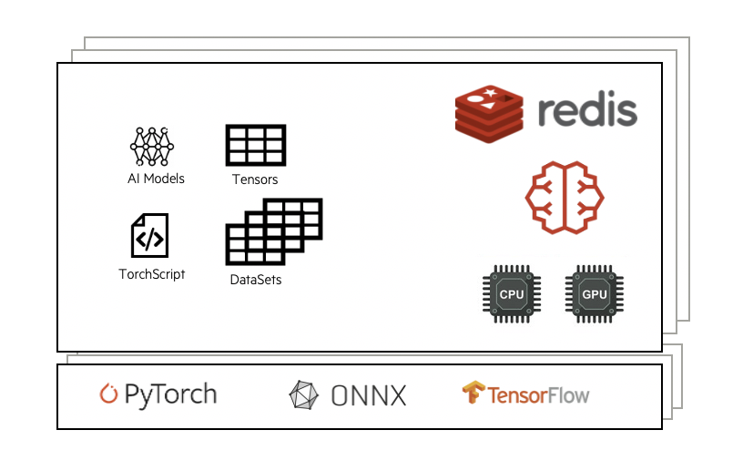
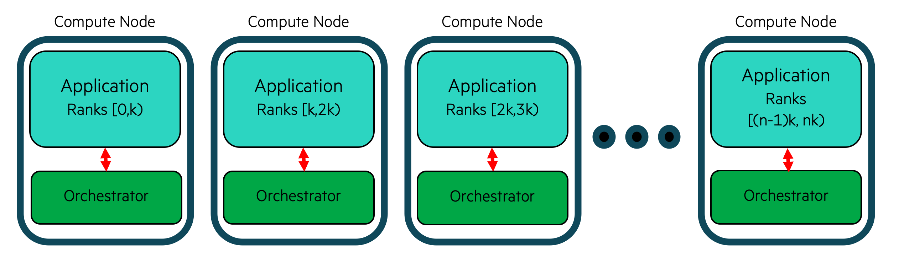

************
Orchestrator
************

The ``Orchestrator`` is an in-memory database that is launched prior to all other
entities within an ``Experiment``. The ``Orchestrator`` can be used to store and retrieve
data during the course of an experiment and across multiple entities. In order to
stream data into or receive data from the ``Orchestrator``, one of the SmartSim clients
(SmartRedis) has to be used within a Model.

|orchestrator|

Combined with the SmartRedis clients, the ``Orchestrator`` is capable of hosting and executing
AI models written in Python on CPU or GPU. The ``Orchestrator`` supports models written with
TensorFlow, Pytorch, TensorFlow-Lite, or models saved in an ONNX format (e.g. sci-kit learn).

Cluster Orchestrator
====================

The ``Orchestrator`` supports single node and distributed memory settings. This means
that a single compute host can be used for the database or multiple by specifying
``db_nodes`` to be greater than 1.

.. |cluster-orc| image:: images/clustered-orc-diagram.png
  :width: 700
  :alt: Alternative text

|cluster-orc|

With a clustered ``Orchestrator``, multiple compute hosts memory can be used together
to store data. As well, the CPU or GPU(s) where the ``Orchestrator`` is running can
be used to execute the AI models, and Torchscript code on data stored within it.

Users do not need to know how the data is stored in a clustered configuration and
can address the cluster with the SmartRedis clients like a single block of memory
using simple put/get semantics in SmartRedis. SmartRedis will ensure that data
is evenly distributed amoungst all nodes in the cluster.

The cluster deployment is optimal for high data throughput scenarios such as
online analysis, training and processing.

Co-located Orchestrator
=======================

A co-located Orchestrator is a special type of Orchestrator that is deployed on
the same compute hosts an a ``Model`` instance defined by the user. In this
deployment, the database is *not* connected together in a cluster and each
shard of the database is addressed individually by the processes running
on that compute host.

|colo-orc|

This deployment is designed for highly performant online inference scenarios where
a distributed process (likely MPI processes) are performing inference with
data local to each process.

This method is deemed ``locality based inference`` since data is local to each
process and the ``Orchestrator`` is deployed locally on each compute host where
the distributed application is running.

To create a co-located model, first, create a ``Model`` instance and then call
the ``Model.colocated_db`` function.

.. currentmodule:: smartsim.entity.model

.. automethod:: Model.colocate_db
    :noindex:

Here is an example of creating a simple model that is co-located with an
``Orchestrator`` deployment

.. code-block:: python

  from smartsim import Experiment
  exp = Experiment("colo-test", launcher="auto")

  colo_settings = exp.create_run_settings(exe="./some_mpi_app")

  colo_model = exp.create_model("colocated_model", colo_settings)
  colo_model.colocate_db(
          port=6780,              # database port
          db_cpus=1,              # cpus given to the database on each node
          debug=False             # include debug information (will be slower)
          limit_app_cpus=False,   # don't overscubscribe app with database cpus
          ifname=network_interface # specify network interface to use (i.e. "ib0")
  )
  exp.start(colo_model)

By default, SmartSim will attempt to make sure that the database and the application
do not fight over resources by taking over the affinity mapping process locally on
each node. This can be disabled by setting ``limit_app_cpus`` to ``False``.

Redis
=====

.. _Redis: https://github.com/redis/redis
.. _RedisAI: https://github.com/RedisAI/RedisAI

The ``Orchestrator`` is built on `Redis`_. Largely, the job of the ``Orchestrator`` is to
create a Python reference to a Redis deployment so that users can launch, monitor
and stop a Redis deployment on workstations and HPC systems.

Redis was chosen for the Orchestrator because it resides in-memory, can be distributed on-node
as well as across nodes, and provides low-latency data access to many clients in parallel. The
Redis ecosystem was a primary driver as the Redis module system provides APIs for languages,
libraries, and techniques used in Data Science. In particular, the ``Orchestrator``
relies on `RedisAI`_ to provide access to Machine Learning runtimes.

At its core, Redis is a key-value store. This means that put/get semantics are used to send
messages to and from the database. SmartRedis clients use a specific hashing algorithm, CRC16, to ensure
that data is evenly distributed amongst all database nodes. Notably, a user is not required to
know where (which database node) data or Datasets (see Dataset API) are stored as the
SmartRedis clients will infer their location for the user.

KeyDB
=====

.. _KeyDB: https://github.com/EQ-Alpha/KeyDB

`KeyDB`_ is a multi-threaded fork of Redis that can be swapped in as the database for
the ``Orchestrator`` in SmartSim. KeyDB can be swapped in for Redis by setting the
``REDIS_PATH`` environment variable to point to the ``keydb-server`` binary.

A full example of configuring KeyDB to run in SmartSim is shown below

.. code-block:: bash

  # build KeyDB
  # see https://github.com/EQ-Alpha/KeyDB

  # get KeyDB configuration file
  wget https://github.com/CrayLabs/SmartSim/blob/d3d252b611c9ce9d9429ba6eeb71c15471a78f08/smartsim/_core/config/keydb.conf

  export REDIS_PATH=/path/to/keydb-server
  export REDIS_CONF=/path/to/keydb.conf

  # run smartsim workload
