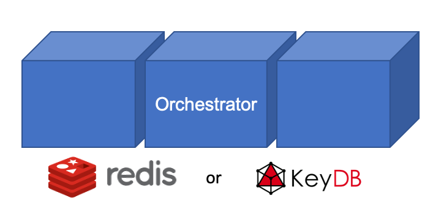

************
Orchestrator
************

The Orchestrator is an in-memory database that is launched prior to all other
entities within an experiment. The Orchestrator can be used to store and retrieve
data during the course of an experiment. In order to stream data into the orchestrator
or receive data from the orchestrator, one of the SmartSim clients (SILC) has to be
used within a Model.

|orchestrator|

The Orchestrator is constructed within a single SmartSim Experiment API call (``Experiment.create_orchestrator()``)
where the user can input the launch parameters such as number of nodes,
instances per node, and allocation to launch on. At launch, the Orchestrator is created
to the launch parameter specifications and optionally constructed into a distributed
memory cluster.

Combined with the SILC clients, the Orchestrator is capable of hosting and executing
AI models written in Python on CPU or GPU. The Orchestrator supports models written with
TensorFlow, Pytorch, TensorFlow-Lite, or models saved in an ONNX format (sci-kit learn).

Redis/KeyDB
===========

The Orchestrator supports two backends: Redis and KeyDB. Both of these databases are compatible
with the Redis API. Currently, the default for the library is Redis due to its compatibility
with multiple AI backends. KeyDB, however, is maintained as a backend as it can be used in cases
where lower latencies are required as KeyDB has been shown to be up to 4 times as fast as Redis in some cases.

Redis was chosen for the Orchestrator because it resides in-memory, can be distributed on-node
as well as across nodes, and provides low-latency access to many clients in parallel. The
Redis ecosystem was a primary driver as the Redis module system provides APIs for languages,
libraries, and techniques used in Data Science.

At its core, Redis is a key-value store. This means that put/get semantics are used to send
messages to and from the database. SmartSim uses a specific hashing algorithm, CRC16, to ensure
that data is evenly distributed amongst all database nodes. Notably, a user is not required to
know where (which database node) data or Datasets (see Dataset API) are stored as the
SILC clients will infer their location for the user.

