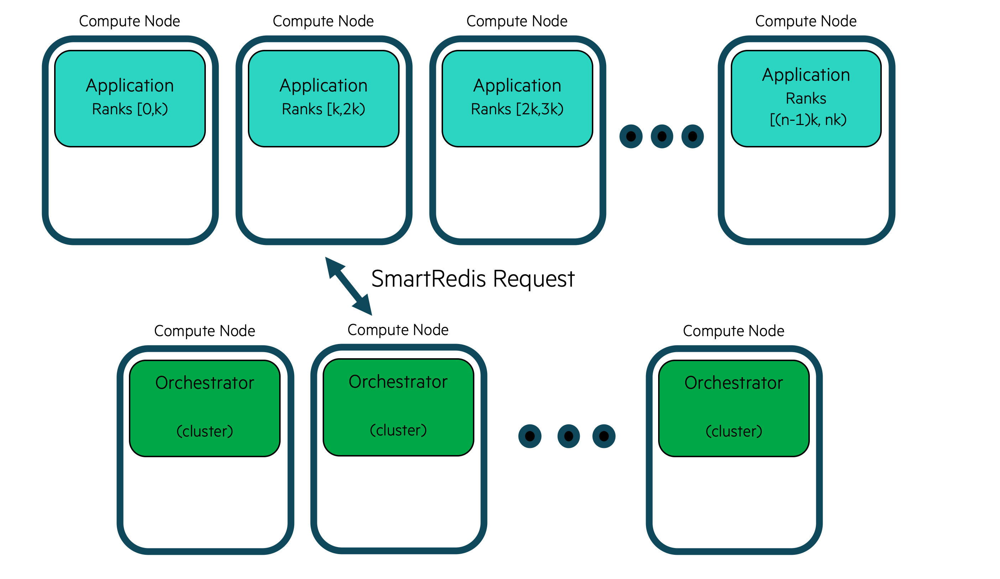

************
Orchestrator
************

========
Overview
========
The ``Orchestrator`` is an in-memory database that is launched prior to all other
entities within an ``Experiment``. The ``Orchestrator`` can be used to store and retrieve
data during the course of an experiment and across multiple entities. In order to
stream data into or receive data from the ``Orchestrator``, one of the SmartSim clients
(SmartRedis) has to be used within a Model.

.. |orchestrator| image:: images/Orchestrator.png
  :width: 700
  :alt: Alternative text

|orchestrator|

Combined with the SmartRedis clients, the ``Orchestrator`` is capable of hosting and executing
AI models written in Python on CPU or GPU. The ``Orchestrator`` supports models written with
TensorFlow, Pytorch, TensorFlow-Lite, or models saved in an ONNX format (e.g. sci-kit learn).

======================
Clustered Orchestrator
======================
--------
Overview
--------
A clustered Orchestrator is a type of deployment where the application and database
are launched on separate compute nodes. A clustered Orchestrator may be single-sharded
(allocated one database node) or multi-sharded (allocated multiple database nodes).
When initializing an ``Orchestrator`` within an Experiment, you may set
the argument `db_nodes` to be 1 or greater than 2. This parameter controls the number
of database nodes your in-memory database will span across.

|cluster-orc|

Clustered Orchestrators support data communication across multiple simulations.
Given that a clustered database is standalone, meaning the database compute node
is separate from the application compute node, the database node does not tear
down after the finish of a SmartSim Model, unlike a colocated orchestrator.
With standalone database deployment, SmartSim can run AI models, and Torchscript
code on the CPU(s) or GPU(s) with existing data in the ``Orchestrator``.
Produced data can then requested by another application.

Users do not need to know how the data is stored in a clustered configuration and
can address the cluster with the SmartRedis clients like a single block of memory
using simple put/get semantics in SmartRedis.

The cluster deployment is optimal for high data throughput scenarios such as
online analysis, training and processing.

-------
Example
-------
This example provides a demonstration on automating the deployment of
a standard Orchestrator. Once the standard database is started,
we demonstrate connecting a client from within the driver script.

The Application Script
======================
To begin writing the application script, import the necessary packages:

.. code-block:: python

  from smartredis import Client, log_data
  from smartredis import *
  import numpy as np

Initialize the Client
---------------------
To establish a connection with the standard database,
we need to initialize a new SmartRedis client.
Since the standard database we launch in the driver script
multi-sharded, we specify the `cluster` as `True`:

.. code-block:: python

  # Initialize a Client
  standard_db_client = Client(cluster=True)

Retrieve Data
-------------
To confirm a successful connection to the database, we retrieve the tensor
we store in the Python driver script.
Use the ``Client.get_tensor()`` method to
retrieve the tensor by specifying the name `tensor_1` we
used during ``Client.put_tensor()`` in the driver script:
.. code-block:: python

    # Retrieve tensor from Orchestrator
    value_1 = standard_db_client.get_tensor("tensor_1")
    # Log tensor
    standard_db_client.log_data(LLInfo, f"The single sharded db tensor is: {value_1}")

Later, when you run the experiment driver script the following output will appear in ``model.out``
located in ``getting-started/tutorial_model/``::

  Default@17-11-48:The single sharded db tensor is: [1 2 3 4]

Store Data
----------
Next, create a NumPy tensor to send to the standard database using
``Client.put_tensor(name, data)``:
.. code-block:: python

  # Create a NumPy array
  array_2 = np.array([5, 6, 7, 8])
  # Use SmartRedis client to place tensor in multi-sharded db
  standard_db_client.put_tensor("tensor_2", array_2)

We will retrieve `"tensor_2"` in the Python driver script.

The Experiment Driver Script
============================
To run the previous application, we must define a Model and Orchestrator within an
experiment. Defining workflow stages requires the utilization of functions associated
with the ``Experiment`` object. The Experiment object is intended to be instantiated
once and utilized throughout the workflow runtime.
In this example, we instantiate an ``Experiment`` object with the name ``getting-started``.
We setup the SmartSim ``logger`` to output information from the Experiment:

.. code-block:: python

  import numpy as np
  from smartredis import Client
  from smartsim import Experiment
  from smartsim.log import get_logger
  import sys

  exe_ex = sys.executable
  logger = get_logger("Example Experiment Log")
  # Initialize the Experiment
  exp = Experiment("getting-started", launcher="auto")

Launch Standard Orchestrator
----------------------------
In the context of this ``Experiment``, it's essential to create and launch
the databases as a preliminary step before any other components since
the application script requests and sends tensors from a launched databases.

We aim to demonstrate the standard orchestrator automation capabilities of SmartSim, so we
create a single database in the workflow: a multi-sharded database.

Step 1: Initialize Orchestrator
'''''''''''''''''''''''''''''''
To create a standard database, utilize the ``Experiment.create_database()`` function.
.. code-block:: python

  # Initialize a multi sharded database
  standard_db = exp.create_database(db_nodes=3)
  exp.generate(standard_db)

Step 2: Start Databases
'''''''''''''''''''''''
Next, to launch the database,
pass the database instance to ``Experiment.start()``.
.. code-block:: python

  # Launch the multi sharded database
  exp.start(standard_db)

The ``Experiment.start()`` function launches the ``Orchestrator`` for use within the workflow.
In other words, the function deploys the database on the allocated compute resources.

Create Client Connections to Orchestrator
-----------------------------------------
The SmartRedis ``Client`` object contains functions that manipulate, send, and receive
data within the database. Each database can have a single, dedicated SmartRedis ``Client``.
Begin by initializing a SmartRedis ``Client`` object for the standard database.

When creating a client connect from within a driver script,
you need to specify the address of the database you would like to connect to.
You can easily retrieve this address using the ``Orchestrator.get_address()`` function:

.. code-block:: python

  # Initialize a SmartRedis client for multi sharded database
  driver_client_standard_db = Client(cluster=True, address=standard_db.get_address()[0])

Store Data Using Clients
------------------------
In the application script, we retrieved a NumPy tensor.
To support the apps functionality, we create a
NumPy array in the python driver script to send to the a database. To
accomplish this, we use ``Client.put_tensor()``:
.. code-block:: python

  # Create NumPy array
  array_1 = np.array([1, 2, 3, 4])
  # Use multi shard db SmartRedis client to place tensor standard database
  driver_client_standard_db.put_tensor("tensor_1", array_1)

Initialize a Model
------------------
In the next stage of the experiment, we
launch the application script by configuring and creating
a SmartSim ``Model``.

Step 1: Configure
'''''''''''''''''
You can specify the run settings of a model.
In this experiment, we invoke the Python interpreter to run
the python script defined in section: The Application Script.
To configure this into a ``Model``, we use the ``Experiment.create_run_settings()`` function.
The function returns a ``RunSettings`` object.
When initializing the ``RunSettings`` object,
we specify the path to the application file,
`application_script.py`, for
``exe_args``, and the run command for ``exe``.
.. code-block:: python

  # Initialize a RunSettings object
  model_settings = exp.create_run_settings(exe=exe_ex, exe_args="/lus/scratch/richaama/standard_orch_model.py")
  model_settings.set_nodes(1)

Step 2: Initialize
''''''''''''''''''
Next, create a ``Model`` instance using the ``Experiment.create_model()``.
Pass the ``model_settings`` object as an argument
to the ``create_model()`` function and assign to the variable ``model``:
.. code-block:: python

  # Initialize the Model
  model = exp.create_model("model", model_settings)

Step 3: Start
'''''''''''''
Next, launch the model instance using the ``Experiment.start()`` function.
.. code-block:: python

  # Launch the Model
  exp.start(model, block=True, summary=True)

.. note::
    We specify `block=True` to ``exp.start()`` because our experiment
    requires that the ``Model`` finish before the experiment continues.
    This is because we will request tensors from the database that
    are inputted by the Model we launched.

Poll Data Using Clients
-----------------------
Next, check if the tensor exist in the standard database using ``Client.poll_tensor()``.
This function queries for data in the database. The function requires the tensor name (`name`),
how many milliseconds to wait in between queries (`poll_frequency_ms`),
and the total number of times to query (`num_tries`):
.. code-block:: python

  # Retrieve the tensors placed by the Model
  value_2 = driver_client_standard_db.poll_key("tensor_2", 100, 100)
  # Validate that the tensor exists
  logger.info(f"The tensor is {value_2}")

The output will be as follows::

  test

Cleanup Experiment
------------------
Finally, use the ``Experiment.stop()`` function to stop the database instances. Print the
workflow summary with ``Experiment.summary()``:

.. code-block:: python

  # Cleanup the database
  exp.stop(standard_db)
  logger.info(exp.summary())

When you run the experiment, the following output will appear::
 test

======================
Colocated Orchestrator
======================
During colocated deployment, the application and database are deployed on the same
compute node.In this deployment, the database is *not* connected together in a
cluster and each shard of the database is addressed individually by the processes
running on that compute host.

.. |colo-orc| image:: images/co-located-orc-diagram.png
  :width: 700
  :alt: Alternative text

|colo-orc|

This deployment is designed for highly performant online inference scenarios where
a distributed process (likely MPI processes) are performing inference with
data local to each process.

This method is deemed ``locality based inference`` since data is local to each
process and the ``Orchestrator`` is deployed locally on each compute host where
the distributed application is running.

Example
-------
This example demonstrates using SmartSim functions and classes to

This example provides a demonstration on automating the deployment of
a colocated Orchestrator within an Experiment.

The example is comprised of two script files:

* The Application Script
* The Experiment Driver Script

**The Application Script Overview:**
The example application script is a Python file that contains
instructions to create and connect a SmartRedis
client to the colocated Orchestrator.
Since a colocated Orchestrator is launched when the Model
is started by the experiment, you may only connect
a SmartRedis client to a colocated database from within
the associated colocated Model script.

**The Application Script Contents:**

1. Connecting a SmartRedis client within the application to send and retrieve a tensor
   from the colocated database.

**The Experiment Driver Script Overview:**
The experiment driver script launches and manages
the example entities with the ``Experiment`` API.
In the driver script, we use the ``Experiment``
to create and launch a colocated ``Model`` instance
launches a colocated Orchestrator and runs the application
script.

**The Experiment Driver Script Contents:**

1. Launching the application script with a co-located database.

The Application Script
----------------------
A SmartRedis client connects and interacts with
a launched Orchestrator.
In this section, we write an application script
that we will use as an executable argument
for the colocated Model. We demonstrate
how to connect a SmartRedis
client to the active colocated database.
Using the created client, we send a tensor
from the database, then retrieve.

.. note::
   You must run the Python driver script to launch the Orchestrator within the
   application script.  Otherwise, there will be no database to connect the
   client to.

To begin writing the application script, provide the imports:
.. code-block:: python

  from smartredis import ConfigOptions, Client, log_data
  from smartredis import *
  import numpy as np

Initialize the Clients
^^^^^^^^^^^^^^^^^^^^^^
To establish a connection with the colocated database,
initialize a new SmartRedis client and specify `cluster=False`
since our database is single-sharded:
.. code-block:: python

  # Initialize a Client
  colo_client = Client(cluster=False)

.. note::
    Since there is only one database launched in the Experiment
    (the colocated database), specifying a a datbase address
    is not required when initializing the client.
    SmartRedis will handle the connection.

Store Data
^^^^^^^^^^
Next, using the SmartRedis client instance, we create and store
a NumPy tensor using ``Client.put_tensor()``:
.. code-block:: python

    # Create NumPy array
    array_1 = np.array([1, 2, 3, 4])
    # Store the NumPy tensor
    colo_client.put_tensor("tensor_1", array_1)

Retrieve Data
^^^^^^^^^^^^^
Next, retrieve the tensor using ``Client.get_tensor()``:
.. code-block:: python

    # Retrieve tensor from driver script
    value_1 = colo_client.get_tensor("tensor_1")
    # Log tensor
    colo_client.log_data(LLInfo, f"The colocated db tensor is: {value_1}")

When the Experiment completes, you can find the following log message in `colo_model.out`::
    Default@21-48-01:The colocated db tensor is: [1 2 3 4]

The Experiment Driver Script
----------------------------
To run the application, specify a Model workload from
within the workflow (Experiment).
Defining workflow stages requires the utilization of functions associated
with the ``Experiment`` object.
In this example, we instantiate an ``Experiment`` object with the name ``getting-started``.
We setup the SmartSim ``logger`` to output information from the Experiment.
.. code-block:: python

    import numpy as np
    from smartredis import Client
    from smartsim import Experiment
    from smartsim.log import get_logger
    import sys

    exe_ex = sys.executable
    logger = get_logger("Example Experiment Log")
    # Initialize the Experiment
    exp = Experiment("getting-started", launcher="auto")

Initialize a Colocated Model
^^^^^^^^^^^^^^^^^^^^^^^^^^^^
In the next stage of the experiment, we
create and launch a colocated ``Model`` that 
runs the application script with a database
on the same compute node.

Step 1: Configure
"""""""""""""""""
In this experiment, we invoke the Python interpreter to run
the python script defined in section: The Application Script.
To configure this into a ``Model``, we use the ``Experiment.create_run_settings()`` function.
The function returns a ``RunSettings`` object.
A ``RunSettings`` allows you to configure
the run settings of a SmartSim entity.
We initialize a RunSettings object and
specify the path to the application file,
`application_script.py`, to the argument
``exe_args``, and the run command to ``exe``.

.. note::
  Change the `exe_args` argument to the path of the application script
  on your file system to run the example.

Use the ``RunSettings`` helper functions to
configure the the distribution of computational tasks (``RunSettings.set_nodes()``). In this
example, we specify to SmartSim that we intend the Model to run on a single compute node.

.. code-block:: python

    # Initialize a RunSettings object
    model_settings = exp.create_run_settings(exe=exe_ex, exe_args="/lus/scratch/richaama/clustered_model.py")
    # Configure RunSettings object
    model_settings.set_nodes(1)

Step 2: Initialize
""""""""""""""""""
Next, create a ``Model`` instance using the ``Experiment.create_model()``.
Pass the ``model_settings`` object as an argument
to the ``create_model()`` function and assign to the variable ``model``.
.. code-block:: python

    # Initialize a SmartSim Model
    model = exp.create_model("colo_model", model_settings)

Step 2: Colocate
""""""""""""""""
To colocate the model, use the ``Model.colocate_db_uds()`` function.
This function will colocate an Orchestrator instance with this Model over
a Unix domain socket connection.
.. code-block:: python

    # Colocate the Model
    model.colocate_db_tcp()

Step 3: Start
"""""""""""""
Next, launch the colocated model instance using the ``Experiment.start()`` function.
.. code-block:: python

    # Launch the colocated Model
    exp.start(model, block=True, summary=True)

test

Cleanup Experiment
^^^^^^^^^^^^^^^^^^

.. code-block:: python

    logger.info(exp.summary())

When you run the experiment, the following output will appear::

  |    | Name   | Entity-Type   | JobID     | RunID   | Time    | Status    | Returncode   |
  |----|--------|---------------|-----------|---------|---------|-----------|--------------|
  | 0  | model  | Model         | 1592652.0 | 0       | 10.1039 | Completed | 0            |

======================
Multiple Orchestrators
======================
SmartSim supports automating the deployment of multiple Orchestrators
from within an Experiment. Data communication for all
Communication with the database via a SmartRedis Client is possible from the
`db_identifier` argument that required when initializing an Orchestrator or
colocated Model during a multi database Experiment. When initializing a SmartRedis
client during the Experiment, first create a ``ConfigOptions`` object
with the `db_identifier` argument created during before passing object to the Client()
init call.